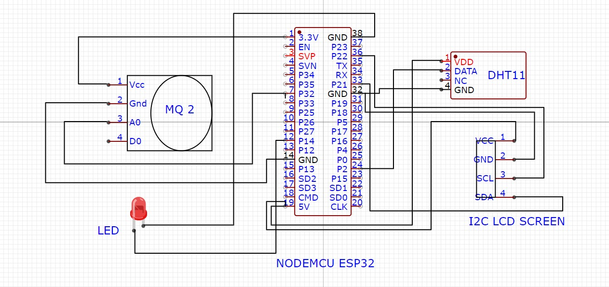

# Smart_Safety_Vest
A wearable IoT-based safety monitoring system designed for industrial workers.
The Smart Safe Vest continuously monitors hazardous gases, temperature, and humidity and sends real-time data to an IoT dashboard while providing immediate alerts using LEDs and an LCD display.

This project aims to enhance worker safety in hazardous industrial environments by integrating sensors directly into wearable gear.

**📌 Project Overview**
Industrial environments often expose workers to toxic gases, extreme temperatures, and unsafe humidity levels. Traditional monitoring systems rely on stationary sensors or manual inspection, which may not provide real-time alerts.
The Smart Safe Vest solves this problem by embedding sensors into a wearable vest that:
- Detects hazardous gas levels
- Monitors temperature and humidity
- Sends real-time data to a cloud dashboard
- Alerts workers immediately during unsafe conditions

**Sensors Used:** MQ2 Gas Sensor (CO, LPG, Smoke) and DHT11 Temperature & Humidity Sensor.

🧠 System Architecture

The system works in the following way:

 1️⃣ Sensors collect environmental data  
 2️⃣ NodeMCU processes sensor readings  
 3️⃣ Data is displayed on LCD  
 4️⃣ Alerts are triggered through LED indicators  
 5️⃣ Data is transmitted via WiFi to the Blynk IoT Dashboard  

 📡 IoT Dashboard

The system integrates with Blynk IoT to visualize data in real-time.

Dashboard displays:
- Temperature
- Humidity
- CO gas levels
- Smoke levels
- LPG levels

Both desktop and mobile dashboards can be used for monitoring.

## 🚨 Alert Mechanism

Alerts are triggered when environmental values exceed safe thresholds.

### Example thresholds:

| Parameter    | Threshold |
|--------------|-----------|
| Temperature  | ≥ 40°C    |
| Humidity     | ≥ 90%     |
| CO Level     | ≥ 3000    |
| Smoke        | ≥ 1000    |
| LPG          | ≥ 500     |

### When triggered:

- LED starts blinking
- LCD shows alert values
- Notification is sent to the Blynk dashboard

## 🧪 Testing and Results

During testing, the system successfully:

- ✅ Detected hazardous gases
- ✅ Monitored temperature and humidity accurately
- ✅ Sent real-time data to the IoT dashboard
- ✅ Triggered alerts instantly in dangerous situations

Workers found the wearable system **lightweight and non-intrusive**, improving usability in industrial environments.

## 🛠 Technologies Used

- ESP32 / NodeMCU
- Arduino IDE
- Blynk IoT
- Embedded C
- IoT Sensors

Resume Version
- Built an IoT-based wearable safety vest using ESP32, gas sensors, and DHT11 for real-time monitoring of industrial environmental hazards.

- Implemented Blynk cloud integration and alert mechanisms to enhance worker safety in hazardous environments.
